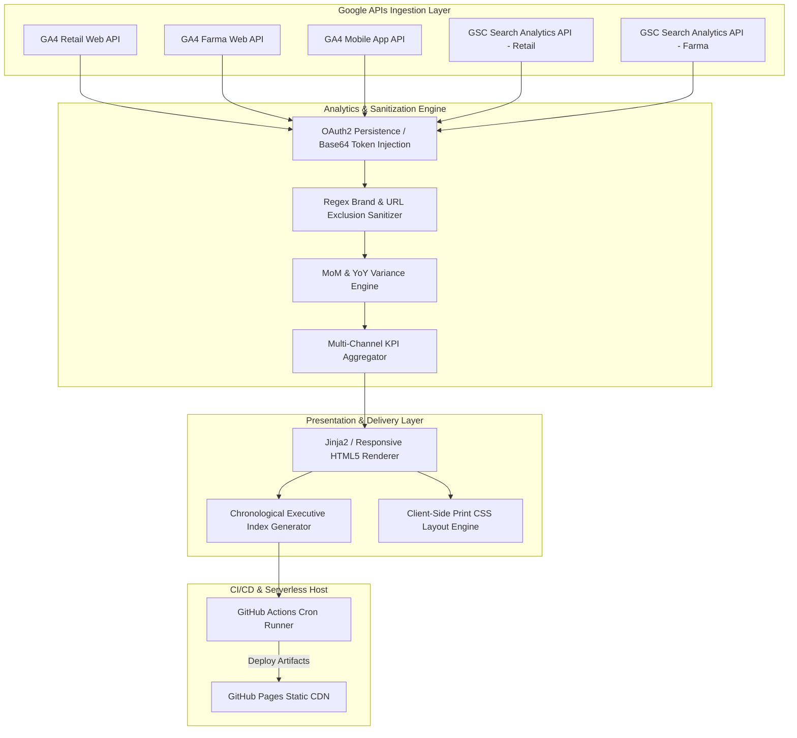

# Enterprise Automated GA4 & Google Search Console BI Reporting Pipeline

[](https://github.com/fabricio-hunt/comprehensive-and-automated-ga4-report/actions)
[](https://fabricio-hunt.github.io/comprehensive-and-automated-ga4-report/)
[](https://www.python.org/)
[](https://opensource.org/licenses/MIT)

An enterprise-grade, serverless, automated Business Intelligence (BI) and SEO reporting pipeline designed to ingest, normalize, and synthesize multi-channel search performance metrics across **Retail (E-commerce)**, **Pharmaceuticals (Farma)**, and **Mobile Applications**.

Built with an autonomous **CI/CD Cloud-Native architecture**, this engine runs on scheduled intervals without dedicated server infrastructure, generating interactive executive HTML dashboards and print-optimized PDF reports hosted via **GitHub Pages**.

---

## 🏛️ System Architecture & Data Pipeline



---

## 🚀 Key Engineering Capabilities

### 1. Multi-Channel Data Ingestion & Sanitization
- **Google Analytics 4 (GA4) API (`v1beta`)**: Extracts organic sessions, conversions, e-commerce revenue, and mobile app KPIs using authenticated service requests.
- **Google Search Console (GSC) API (`v1`)**: Queries organic search impressions, clicks, click-through rates (CTR), and average positions across multiple domain properties.
- **Smart Brand Term Exclusions**: Implements regex-driven domain filtering to isolate non-branded organic discovery, automatically purging brand terms and common misspellings (`bemol`, `bmol`, `bemil`, `ertc`, etc.).
- **URL Path Sanitization**: Strips internal, transactional, and non-SEO account paths (e.g., `/account`, `/emprestimo-pessoal`, `/contabemol`, `/emprestimos`) from top-page rankings.

### 2. Time-Series BI & Variance Analytics
- **Automated MoM & YoY Deltas**: Computes statistical percentage variations for **Month-over-Month (MoM)** and **Year-over-Year (YoY)** performance across all primary KPIs.
- **Active Organic Keyword Inventory**: Dynamically aggregates distinct search queries generating nonzero impressions within the reporting window.
- **Comparative Chart Series**: Builds normalized multi-year revenue and impression time series formatted for client-side JavaScript visualization.

### 3. Responsive Executive UI & Print Calibration
- **Print-First Responsive HTML5**: Utilizes custom CSS variables, glassmorphism UI cards, and responsive grids designed for high-density displays.
- **Calibrated Print Stylesheet (`@media print`)**: Engineered with strict `@page` landscape margins, CSS `break-inside: avoid` rules, and exact color preservation (`print-color-adjust: exact`) to allow instant client-side PDF export without external headless browsers.
- **Chronological Report Portal (`index.html`)**: Automatically generates a directory portal indexing all historical monthly reports in newest-first order.

### 4. Zero-Server CI/CD Cloud Automation
- **Scheduled Cron Workflows**: Configured in GitHub Actions (`.github/workflows/relatorio_mensal.yml`) to execute autonomously on the **3rd of every month** (`0 11 3 * *`).
- **Secure Secret Ingestion**: Authenticates against Google Cloud Platform APIs using an encrypted Base64-encoded OAuth token (`GCP_TOKEN_BASE64`) stored in repository secrets.
- **Native GitHub Pages CD**: Utilizes official GitHub Actions deployment pipelines (`deploy-pages`) with a `.nojekyll` flag to serve the generated static assets over a global CDN.

---

## 📂 Codebase & Structure

```text
comprehensive-and-automated-ga4-report/
├── .github/
│   └── workflows/
│       ├── relatorio_mensal.yml    # Monthly cron pipeline & GA4/GSC API runner
│       └── deploy_pages.yml        # CD pipeline for GitHub Pages static hosting
├── seo_report_auto/
│   ├── config/
│   │   └── config.json             # GA4 property IDs, GSC domains, & query filters
│   ├── src/
│   │   ├── auth.py                 # OAuth2 authentication & Base64 credential deserializer
│   │   ├── ga4_client.py           # GA4 reporting API client & KPI calculator
│   │   ├── gsc_client.py           # GSC search analytics client & query sanitizer
│   │   ├── data_processor.py       # Time-series normalization & YoY/MoM variance engine
│   │   ├── html_renderer.py        # Jinja2 HTML report generator & portal indexer
│   │   └── pdf_exporter.py         # Optional Playwright-based CLI PDF renderer
│   ├── output/
│   │   ├── index.html              # Executive portal dashboard
│   │   ├── Relatorio_SEO_*.html    # Monthly generated standalone HTML reports
│   │   └── .nojekyll               # GitHub Pages static asset bypass flag
│   ├── gerar_relatorio.py          # CLI entrypoint script for local & CI execution
│   └── requirements.txt            # Pinned Python dependency manifest
└── README.md
```

---

## 🛠️ Local Development & CLI Usage

### Prerequisites
- **Python 3.11+**
- Active Google Cloud Platform (GCP) Project with **Google Analytics Data API** and **Google Search Console API** enabled.
- OAuth 2.0 Desktop Application Client Credentials (`client_secrets.json`).

### 1. Environment Setup
Clone the repository and install dependencies using `pip`:

```bash
git clone https://github.com/fabricio-hunt/comprehensive-and-automated-ga4-report.git
cd comprehensive-and-automated-ga4-report/seo_report_auto

python -m venv .venv
# Linux/macOS:
source .venv/bin/activate
# Windows PowerShell:
.\.venv\Scripts\Activate.ps1

pip install --upgrade pip
pip install -r requirements.txt
```

### 2. Authentication Cache Setup
Place your Google Cloud credentials in `seo_report_auto/config/client_secrets.json`. On first run, an OAuth browser flow will generate a persistent token in `seo_report_auto/cache/token.pickle`.

### 3. CLI Options & Commands

Run the entrypoint script `gerar_relatorio.py` with custom flags:

```bash
# Generate report for the previous month without local PDF rendering (recommended for web/CI)
python gerar_relatorio.py --mes-anterior --no-pdf

# Generate report for a specific month/year
python gerar_relatorio.py --mes 6 --ano 2026 --no-pdf

# Generate both HTML report and local static PDF via Playwright
python gerar_relatorio.py --mes-anterior
```

---

## 🔐 Automated CI/CD Setup (GitHub Actions)

To enable autonomous monthly reporting without local intervention:

1. **Export Local Token to Base64** (PowerShell):
   ```powershell
   [Convert]::ToBase64String([IO.File]::ReadAllBytes("seo_report_auto\cache\token.pickle")) | Set-Clipboard
   ```
2. **Configure Repository Secret**:
   - Go to your GitHub Repository ➔ **Settings** ➔ **Secrets and variables** ➔ **Actions** ➔ **New repository secret**.
   - **Name**: `GCP_TOKEN_BASE64`
   - **Value**: Paste the clipboard content.
3. **Enable GitHub Pages Host**:
   - Go to **Settings** ➔ **Pages**.
   - Under **Build and deployment** ➔ **Source**, select **GitHub Actions**.

The pipeline will automatically run on the 3rd of every month at `08:00 AM (UTC-4)` or can be triggered manually via the **Actions ➔ Run workflow** button.

---

## 📄 License
This software is licensed under the [MIT License](https://opensource.org/licenses/MIT).
